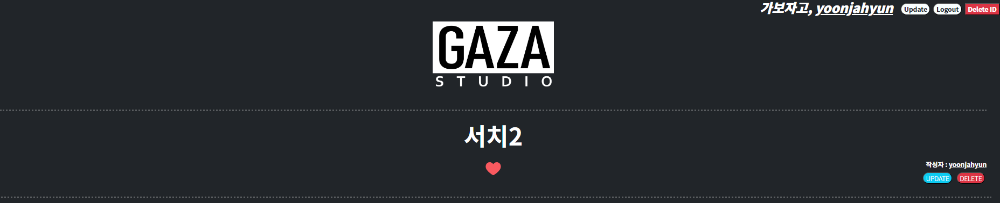

# 사용자 인증 기반 영화 DB 설계

---

프로젝트 진행날짜 : 2023.04.07 ~ 2023.04.16

프로젝트 진행기간 : 10일

프로젝트 진행인원 : 2인

## 📓 배운 것

---

1. 데이터를 생성, 조회, 수정, 삭제할 수 있는 Web application 제작
2. Django web framework를 사용한 데이터 처리
3. Django Model과 ORM에 대한 이해
4. Django Authentication System에 대한 이해
5. Database many to one relationship(1:N) 및 many to many relationship(M:N)에 대한 이해

## 🖥️ 개발도구 및 라이브러리

---

- 개발도구
  - Visual Studio Code
  - Google Chrome
  - Django 3.2

## 📎 명세서

---

커뮤니티 웹 서비스의 데이터 구성 단계

영화 데이터의 생성, 조회, 수정, 삭제, 좋아요가 가능한 애플리케이션을 완성

로그인, 로그아웃, 회원가입, 회원탈퇴, 회원정보수정, 비밀번호변경, 팔로우가능한 애플리케이션

전체 영화 목록 페이지 조회, 새로운 영화 생성 페이지 조회 & 단일 영화 데이터 저장, 단일 영화 상세 페이지 조회, 기존 영화 수정 페이지 조회 & 단일 영화 데이터 수정, 단일 영화 데이터 삭제

## 💡 아이디어 및 구현

---

### movies app

1. index.html : 전체 영화 목록 조회 페이지
   - 데이터베이스에 존재하는 모든 영화의 목록 표시
   - 영화 제목 및 평점 표시, 제목을 클릭 시 해당 영화의 상세 조회 페이지 이동
2. detail.html : 영화 상세 페이지
   - 특정 영화 상세 페이지 표시
   - 해당 영화의 수정 및 삭제 버튼 표시
   - 전체 영화 목록 조회 페이지로 이동하는 링크 표시
3. create.html : 영화 생성 페이지
   - 정보 제출(submit)시 단일 영화 데이터를 저장하는 URL로 요청과 함께 전송
   - 전체 영화 목록 조회 페이지(index.html)로 이동하는 링크(back)를 표시
4. update.html : 영화 수정 페이지
   - 영화 상세 정보 페이지(detail.html)로 이동하는 링크(back)를 표시

### accounts app

1. login.html
   - 로그인을 위한 페이지
2. signup.html
   - 회원가입을 위한 페이지
3. update.html
   - 회원정보 수정 페이지
4. change_password.html
   - 비밀번호 변경 페이지
5. profile.html
   - 프로필 페이지
   - 팔로우 팔로잉 표시
   - 작성한 글, 좋아요한 글 표시
- 로그인 한 회원만 영화 정보를 생성, 수정, 삭제 가능 및 댓글 생성, 삭제 가능
- 본인이 작성한 영화 정보에 대해서만 수정, 삭제 가능 및 댓글에 대해서만 삭제 가능
- 비밀번호 변경 직후 로그인 상태를 유지
- 본인 팔로우 불가능

## ✏️ 담당 업무

---

- Django ORM를 사용해 CRUD 구현
  - movies app 생성
  - accounts app 생성
  - models, forms 생성
- movies detail.html
  - 하트와 작성자 표기 묶어서 표기
  - 작성자일 경우 업데이트 및 삭제 기능 표시
  - 로그인 하지 않을 경우 좋아요 안보이게 하기

- movies update.html
  
  - 뒤로가기 추가
  
  - 부트스트랩 폼 적용 및 수정
    
      

- accounts update.html
  
  - 부트스트랩 적용 및 수정
    
      

- accounts change_pssword.html
  
  - 부트스트랩 적용 및 수정

- accounts profile.html
  
  - 팔로잉 팔로워 표시
  
  - 본인 계정일 땐 팔로우 버튼 안보이게 하기
  
  - 이미 팔로우 했다면 팔로우 버튼 대신 언팔로우 버튼
    
    
    
    
    
    

## 💎 스크린샷

---

